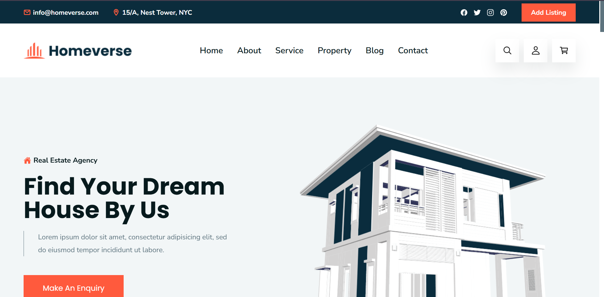
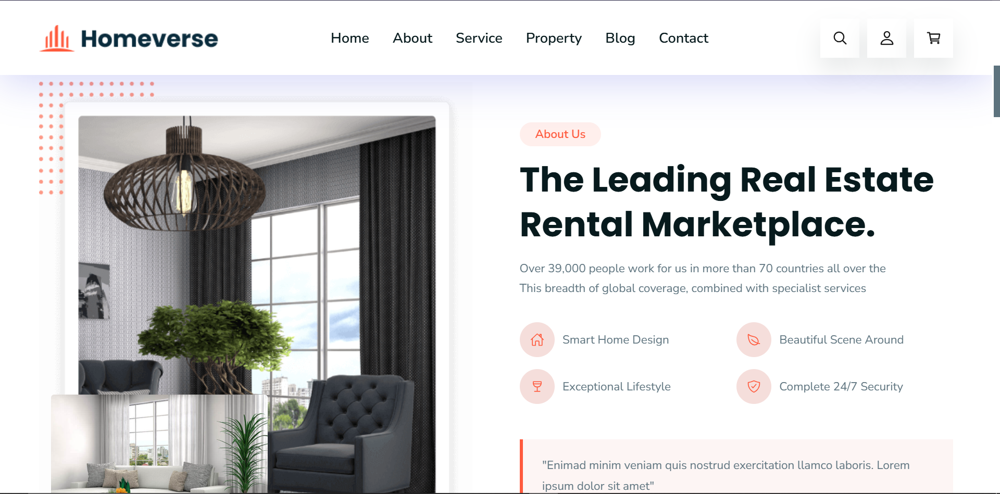
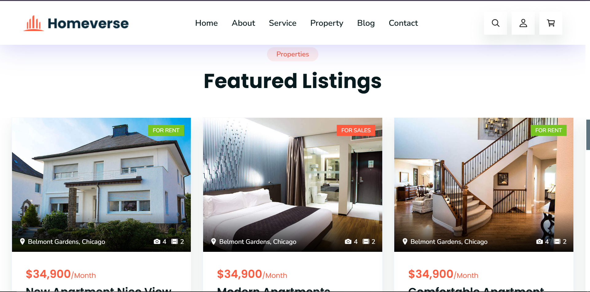

# Homeverse

**Homeverse** is a fully responsive **Real Estate Website** built using **HTML, CSS & JavaScript**.  
It showcases properties and offers a clean, modern, mobile-friendly browsing experience — perfect for real estate portfolios or landing pages. :contentReference[oaicite:1]{index=1}

## 📌 Features

- 🔹 Fully responsive design — works on desktop, tablet & mobile screens. :contentReference[oaicite:2]{index=2}  
- 🔹 Modern, clean UI for property showcasing. :contentReference[oaicite:3]{index=3}  
- 🔹 Built with standard web technologies — no frameworks required. :contentReference[oaicite:4]{index=4}  
- 🔹 Easy to customize layout, colors, and content.

## 📁 Project Structure

homeverse-master/
├── assets/ # Images & other media
├── readme-images/ # Illustrations/screenshots for README
├── index.html # Main landing page
├── style-guide.md # Style guide reference
├── favicon.svg # Website favicon

## 🧰 Technologies Used

✔️ HTML5  
✔️ CSS3  
✔️ JavaScript  
✔️ Responsive Web Design  
✔️ Flexbox & Grid

## 🛠️ Getting Started

### 📋 Prerequisites

Before you begin, make sure you have:

- A modern web browser (Chrome/Firefox/Edge/Safari)  
- (Optional) Git installed if you want to clone locally

### 📌 Installation

1. **Clone the repository**
git clone https://github.com/sarthak291/homeverse-master.git
Navigate into project
cd homeverse-master
Open index.html in your browser
Double-click the file or open it via your editor/IDE to view locally.

🧠 Customize
You can modify:
Images in assets/
Text content in index.html
Styles in CSS
Add more pages & sections as needed

💡 How to Use
This template works well as:
✔ Personal portfolio site
✔ Real estate listing page
✔ Front-end demo
✔ UI practice project

📷 Screenshots

📬 Contact
If you have questions or improvements, feel free to open an issue or reach out!

Enjoy building with Homeverse! 🚀
